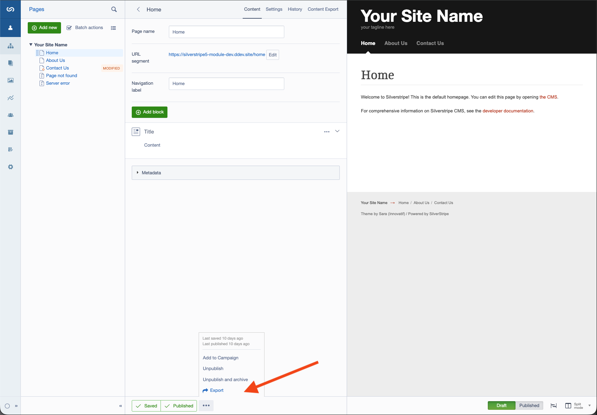
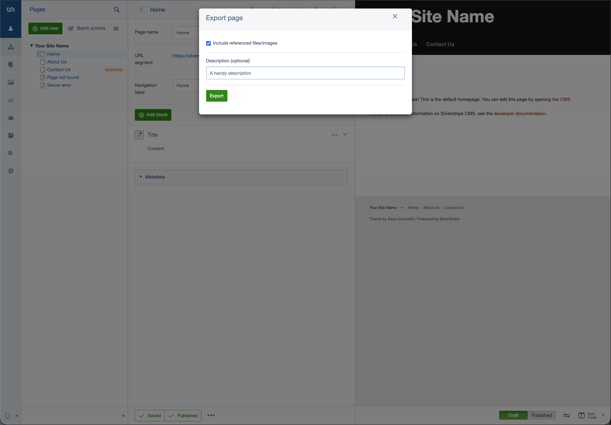
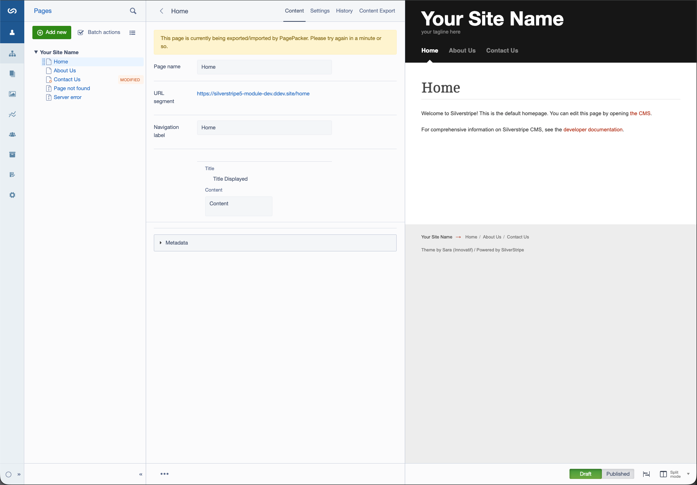
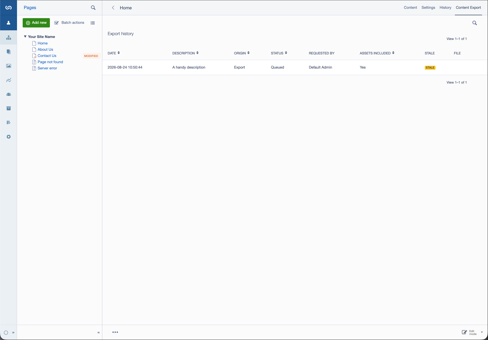
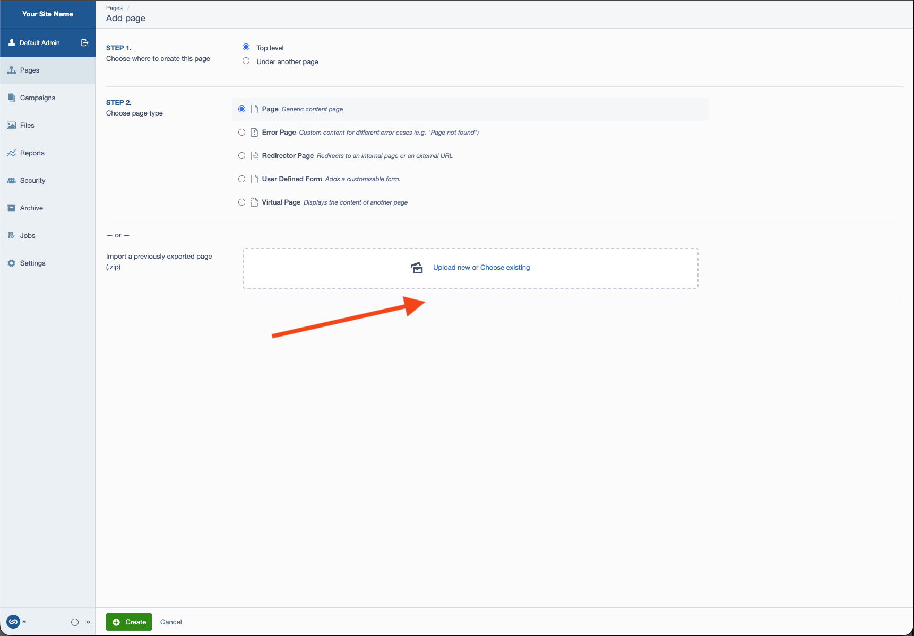
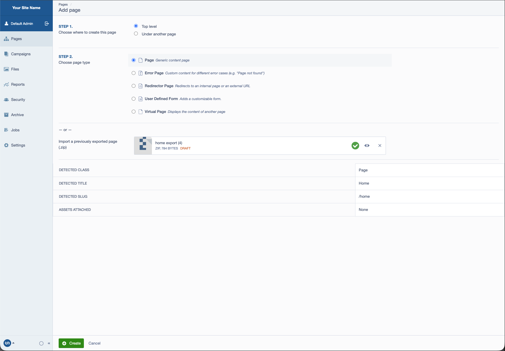
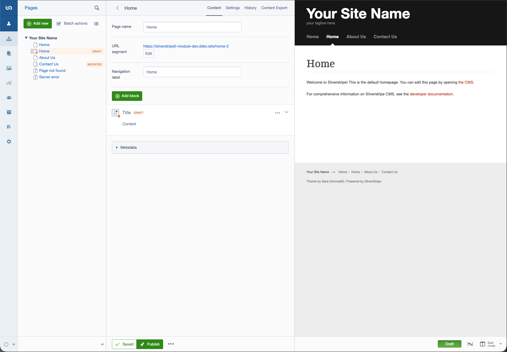
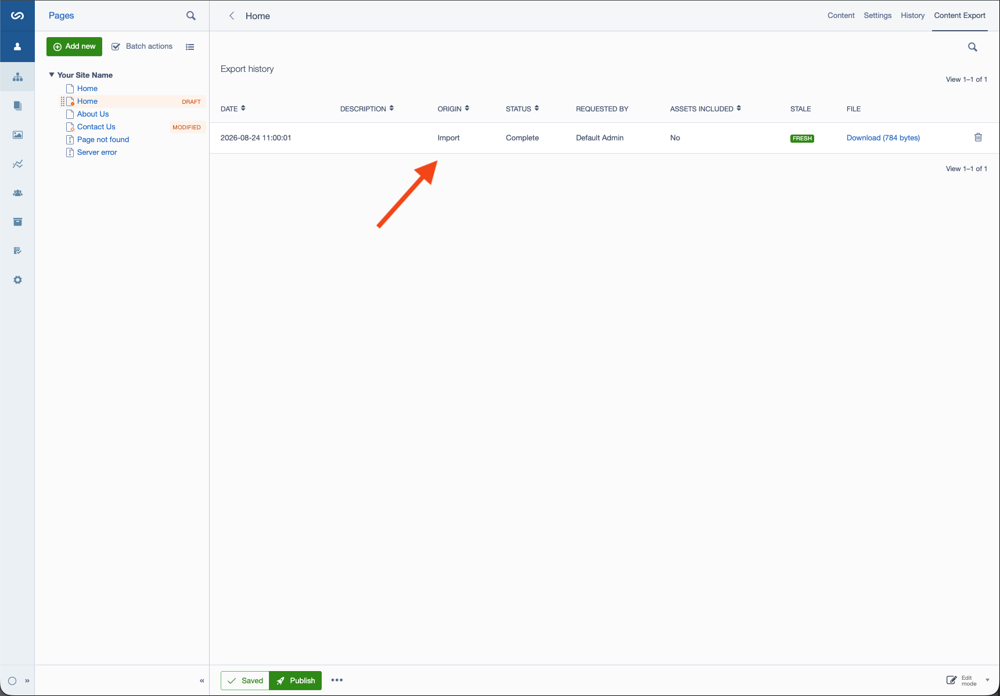
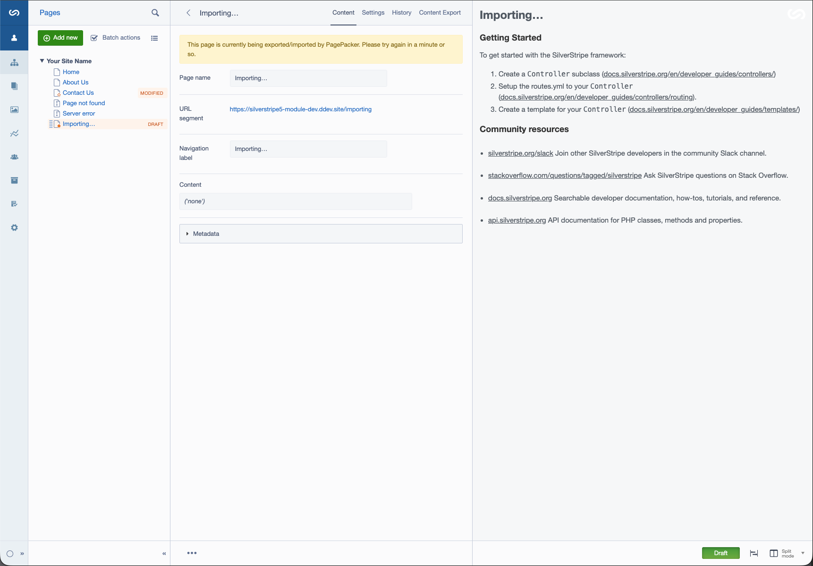

# PagePacker — user guide

PagePacker adds two things to the CMS: an **Export** action on any page, and an option to
**import** a previously exported file when creating a new page. Together these let you copy
a page — content, Elemental blocks, Userforms fields, and any files/images it uses — from
one environment to another (e.g. from a staging site to production) without needing a
developer.

Both actions require the **"Export/import SiteTree page content"** permission. If you don't
see the options described below, ask an administrator to grant your Security group the
`SITETREE_IMPORT_EXPORT` permission under **Security → Groups** in the CMS.

## Exporting a page

1. Open the page you want to export in the CMS.
2. Click the **More options** (⋯) menu next to the Save/Publish buttons.
3. Click **Export**.

4. A dialog opens with two options:
   - **Include referenced files/images** — on by default. Bundles any files or images the
     page uses (including ones embedded inline in text via TinyMCE) into the exported
     file, so the page looks right as soon as it's imported elsewhere. Turn this off for a
     smaller file if you know the target environment already has the same assets.
   - **Description** — an optional short note (e.g. "before Christmas campaign edits") to
     help you tell exports apart later.

 

5. Click **Export**. You'll be taken to the page's **Content Export** tab with a
   confirmation message. The export runs in the background — it doesn't happen instantly.

> **Note:** exporting always packages the page's **published (live)** content, not unsaved
> draft changes. Publish the page first if you want your latest edits included.

Your page will be locked for editing while the export is queued and exported - this is to
prevent new changes inadvertently being included.

### The Content Export tab

Every page that has been exported (or was itself created by importing a file) has a
**Content Export** tab alongside Content, Settings, and History.

This tab lists every export and import for the page, most recent first, showing:

| Column | Meaning |
|---|---|
| Created | When the export/import was requested |
| Description | The note you added, if any |
| Origin | `Export` (created here) or `Import` (the file this page was created from) |
| Status | `Queued`, `Complete`, or `Failed` |
| Requested by | Who triggered it |
| Assets included | Whether files/images were bundled |
| Fresh / Stale | See below |
| Download | A link to the exported file, once complete |

You can delete old export entries from this list once you no longer need them.

**Fresh vs. Stale:** an export is marked **Fresh** if nothing on the page (or anything the
page owns, including nested Elemental blocks) has changed since that export was taken, and
**Stale** once it has. A stale badge doesn't stop you downloading the file — it's just a
hint that the file no longer reflects the page's current published content, so you may want
to re-export before using it.

## Importing a page

1. Go to **Pages**, then **Add new page** (or **Add new**), and choose where the new page
   should be created (top level or under an existing page).
2. Instead of picking a page type from the list, look for the
   **"Import a previously exported page"** upload field beneath it.

3. Upload the exported file. Once it finishes uploading, a preview panel appears showing:
   - The page type it will create
   - Its title and URL
   - How many assets (files/images) are bundled
   - A warning if that page type isn't installed on this site — importing will still
     create a bare page in that case, but its specific fields/blocks won't be recreated

4. Check the preview, then click **Create**. You're taken straight to the new page, which
   is locked for editing while the import runs in the background.
5. Once the import finishes, the lock is lifted and the page is ready to review. It starts
   life as a **draft** — check it over and publish it yourself when you're happy with it.

   

   Its Content Export tab will already show the import file as history.

   

If an import fails, the new page is kept (retitled to flag the failure) rather than
disappearing, and the Content Export tab records a **Failed** entry with a status message —
pass this on to your developer if you need help diagnosing it.

## While an export or import is running

A page shows a banner at the top of its Content and Settings tabs while it has an export or
import actively in progress, and can't be edited or published until that job finishes. This
is normal — it prevents the background job and an editor from changing the page at the same
time. Wait for the job to complete (or refresh the page after a minute) and the banner will
clear.

## Frequently asked questions

**Does exporting publish or change my page?**
No. Exporting only reads the page's current published content — it never modifies the page
itself.

**Can I import into an existing page rather than creating a new one?**
No — importing always creates a brand-new draft page. If you want to replace an existing
page's content, delete or unpublish the old one after checking the new import looks right,
or ask a developer for help if you need a more surgical merge.

**Why is there a delay before my export/import finishes?**
Exports and imports run as background jobs rather than happening instantly, so that large
pages with lots of assets don't time out a normal web request. Processing time depends on
how often background jobs run on your environment — check with your developer if a job
seems stuck in "Queued" for an unusually long time.
